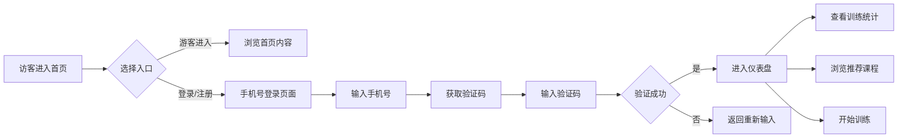

## 1. Product Overview
代起（DAIQI FITNESS）是一款AI驱动的健身训练平台，为用户提供个性化训练计划和专业课程。

- **核心目标**：帮助用户通过AI定制化训练方案实现健身目标，无论是否有健身经验都能轻松开始
- **目标用户**：健身爱好者、运动初学者、追求健康生活方式的人群
- **市场价值**：通过AI技术提供个性化、高效的健身指导，降低用户入门门槛

## 2. Core Features

### 2.1 User Roles
| Role | Registration Method | Core Permissions |
|------|---------------------|------------------|
| Guest User | 访客入口 | 浏览课程、查看首页内容 |
| Registered User | 手机号注册/登录 | 使用AI训练计划、进度追踪、课程学习 |

### 2.2 Feature Module
1. **首页**: Hero区域、功能特性卡片、页脚导航
2. **仪表盘**: 训练统计、课程推荐、计划概览
3. **登录/注册**: 手机号验证、用户注册流程

### 2.3 Page Details
| Page Name | Module Name | Feature description |
|-----------|-------------|---------------------|
| 首页 | Hero Section | 品牌宣传语、行动按钮、背景图 |
| 首页 | Feature Cards | 专业课程、AI训练计划、进度可视化三大特性 |
| 首页 | Footer | 关于我们、支持、法律等链接 |
| 仪表盘 | 统计面板 | 本周训练数据、卡路里消耗、时长统计 |
| 仪表盘 | 课程推荐 | 推荐课程列表、课程信息展示 |
| 仪表盘 | 计划概览 | 当前训练计划、今日任务 |
| 登录/注册 | 表单 | 手机号输入、验证码验证、协议勾选 |

## 3. Core Process

## 4. User Interface Design

### 4.1 Design Style
- **主色调**: 深色背景（#1a1a1a）搭配橙色主色（#ff8c00）
- **辅助色**: 蓝色渐变用于Hero背景
- **按钮样式**: 圆角矩形，橙色主按钮，深色次要按钮
- **字体**: 中文使用思源黑体，英文使用Helvetica
- **布局风格**: 卡片式布局，现代深色主题
- **图标风格**: 线性图标，橙色高亮

### 4.2 Page Design Overview

| Page Name | Module Name | UI Elements |
|-----------|-------------|-------------|
| 首页 | Hero Section | 深色渐变背景、跑步剪影、大标题文字、两个CTA按钮 |
| 首页 | Feature Cards | 三个卡片并排展示，图标+标题+描述 |
| 首页 | Footer | 品牌Logo、四列链接布局、版权信息 |
| 仪表盘 | Header | Logo、搜索框、用户头像 |
| 仪表盘 | Stats Panel | 环形进度图、柱状统计图 |
| 仪表盘 | Course Cards | 课程封面图、时长、难度标签 |
| 登录/注册 | Form | 手机号输入框、验证码输入框、协议复选框、提交按钮 |

### 4.3 Responsiveness
- **Desktop-first** 设计
- 响应式适配移动端：卡片堆叠、导航折叠
- 触摸友好的按钮尺寸（最小44px）

### 4.4 Animation Effects
- Hero区域渐入动画
- 卡片悬停缩放效果
- 进度条动画
- 页面切换过渡效果