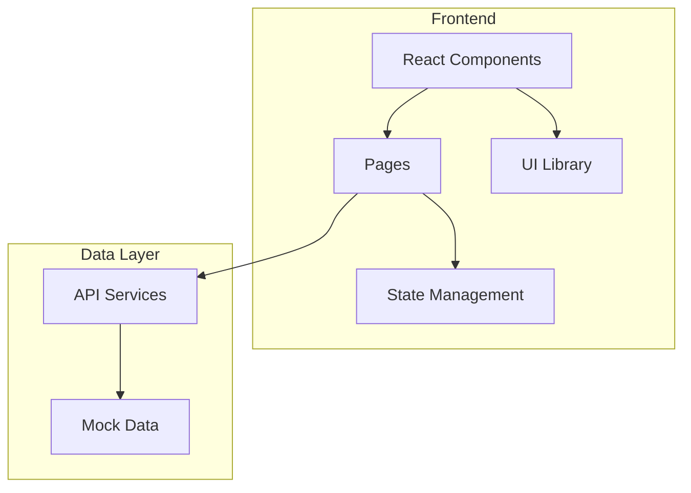
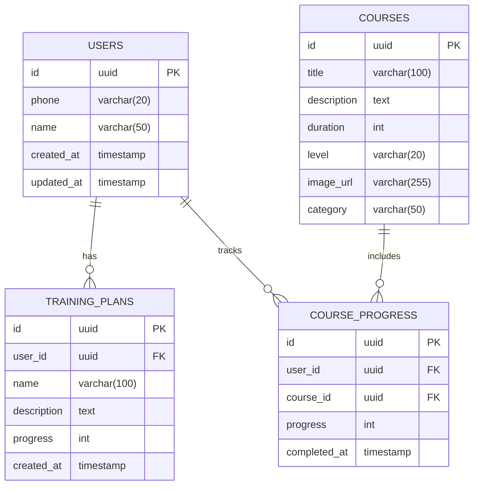

## 1. Architecture Design



## 2. Technology Description

- **Frontend Framework**: React@18 + TypeScript
- **Build Tool**: Vite@6
- **Styling**: TailwindCSS@3
- **UI Components**: shadcn/ui
- **Icons**: lucide-react
- **State Management**: Zustand
- **Routing**: React Router DOM
- **Backend**: Supabase (Auth + Database)

## 3. Route Definitions

| Route | Purpose | Component |
|-------|---------|-----------|
| `/` | 首页（Hero页面） | HomePage |
| `/dashboard` | 用户仪表盘 | Dashboard |
| `/auth` | 登录/注册页面 | AuthPage |

## 4. API Definitions

### 4.1 Auth API
| Endpoint | Method | Description |
|----------|--------|-------------|
| `/api/auth/send-code` | POST | 发送验证码 |
| `/api/auth/verify` | POST | 验证验证码并登录 |

### 4.2 User API
| Endpoint | Method | Description |
|----------|--------|-------------|
| `/api/user/profile` | GET | 获取用户信息 |
| `/api/user/stats` | GET | 获取用户训练统计 |

### 4.3 Course API
| Endpoint | Method | Description |
|----------|--------|-------------|
| `/api/courses` | GET | 获取课程列表 |
| `/api/courses/:id` | GET | 获取课程详情 |

## 5. Data Model

### 5.1 Data Model Definition



### 5.2 Data Definition Language

```sql
CREATE TABLE users (
    id UUID PRIMARY KEY DEFAULT uuid_generate_v4(),
    phone VARCHAR(20) UNIQUE NOT NULL,
    name VARCHAR(50),
    created_at TIMESTAMP DEFAULT NOW(),
    updated_at TIMESTAMP DEFAULT NOW()
);

CREATE TABLE training_plans (
    id UUID PRIMARY KEY DEFAULT uuid_generate_v4(),
    user_id UUID REFERENCES users(id),
    name VARCHAR(100) NOT NULL,
    description TEXT,
    progress INT DEFAULT 0,
    created_at TIMESTAMP DEFAULT NOW()
);

CREATE TABLE courses (
    id UUID PRIMARY KEY DEFAULT uuid_generate_v4(),
    title VARCHAR(100) NOT NULL,
    description TEXT,
    duration INT,
    level VARCHAR(20),
    image_url VARCHAR(255),
    category VARCHAR(50)
);

CREATE TABLE course_progress (
    id UUID PRIMARY KEY DEFAULT uuid_generate_v4(),
    user_id UUID REFERENCES users(id),
    course_id UUID REFERENCES courses(id),
    progress INT DEFAULT 0,
    completed_at TIMESTAMP
);

GRANT SELECT ON users TO anon;
GRANT ALL PRIVILEGES ON users TO authenticated;

GRANT SELECT ON training_plans TO anon;
GRANT ALL PRIVILEGES ON training_plans TO authenticated;

GRANT SELECT ON courses TO anon;
GRANT ALL PRIVILEGES ON courses TO authenticated;

GRANT SELECT ON course_progress TO anon;
GRANT ALL PRIVILEGES ON course_progress TO authenticated;
```

## 6. Project Structure

```
src/
├── components/          # 公共组件
│   ├── layout/         # 布局组件
│   ├── ui/             # UI基础组件
│   └── common/         # 通用组件
├── pages/              # 页面组件
├── hooks/              # 自定义hooks
├── store/              # Zustand状态管理
├── api/                # API服务
├── utils/              # 工具函数
├── data/               # Mock数据
└── styles/             # 全局样式
```